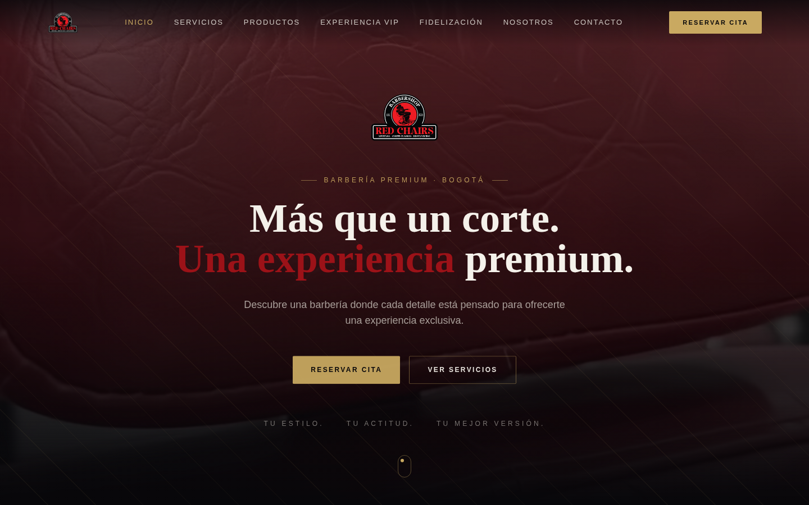
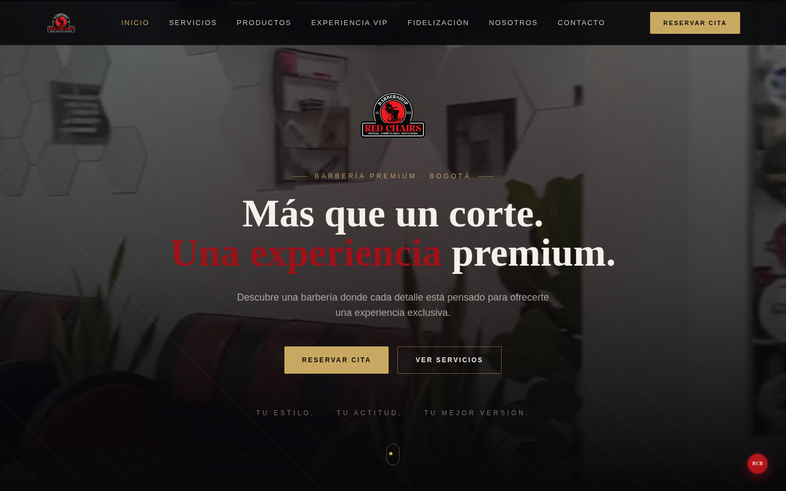
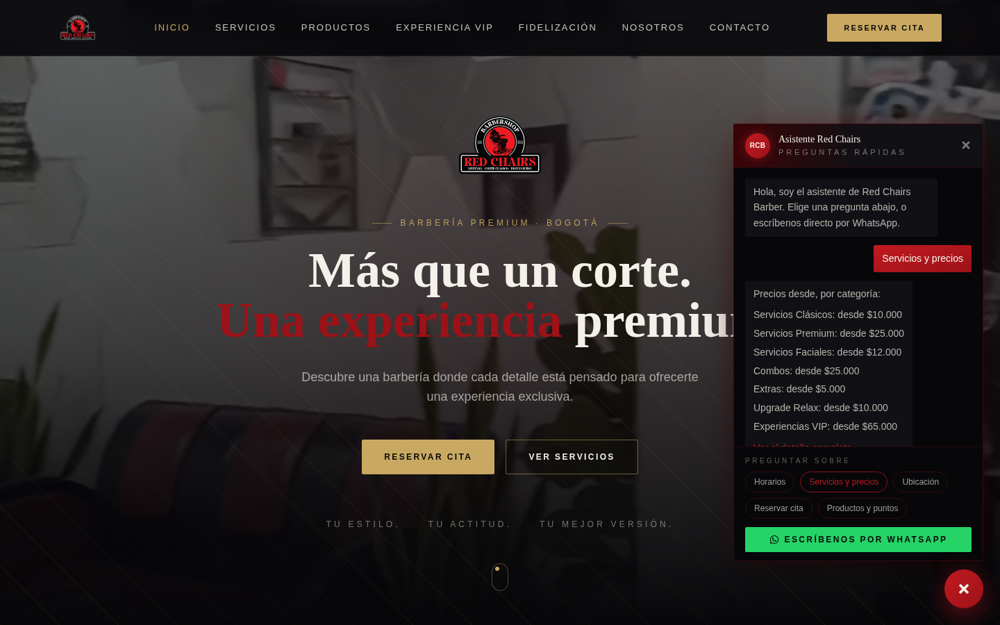
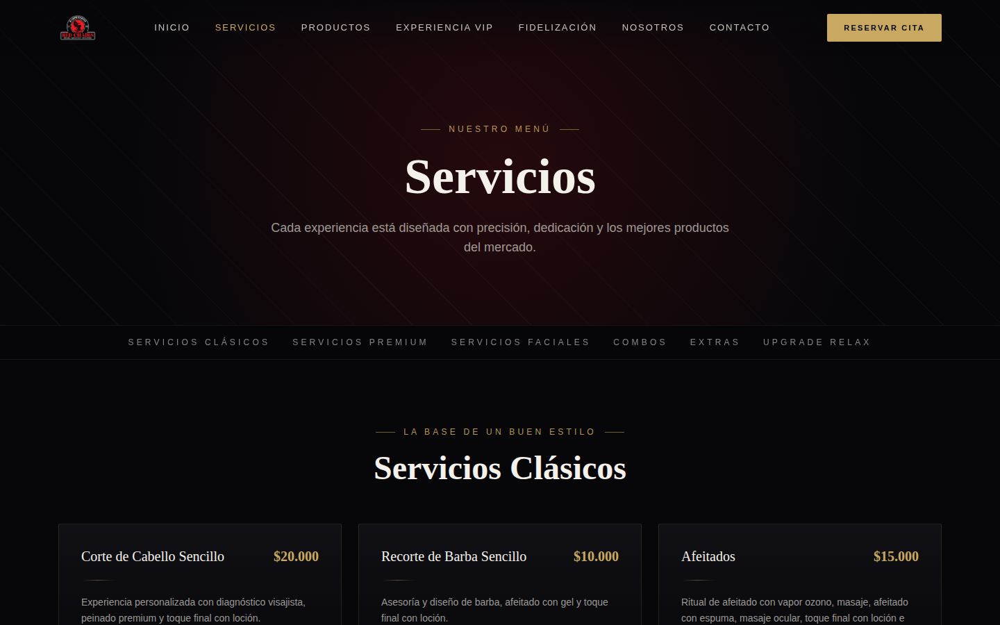
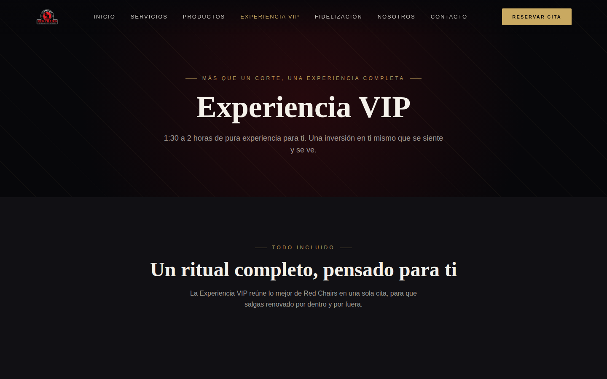
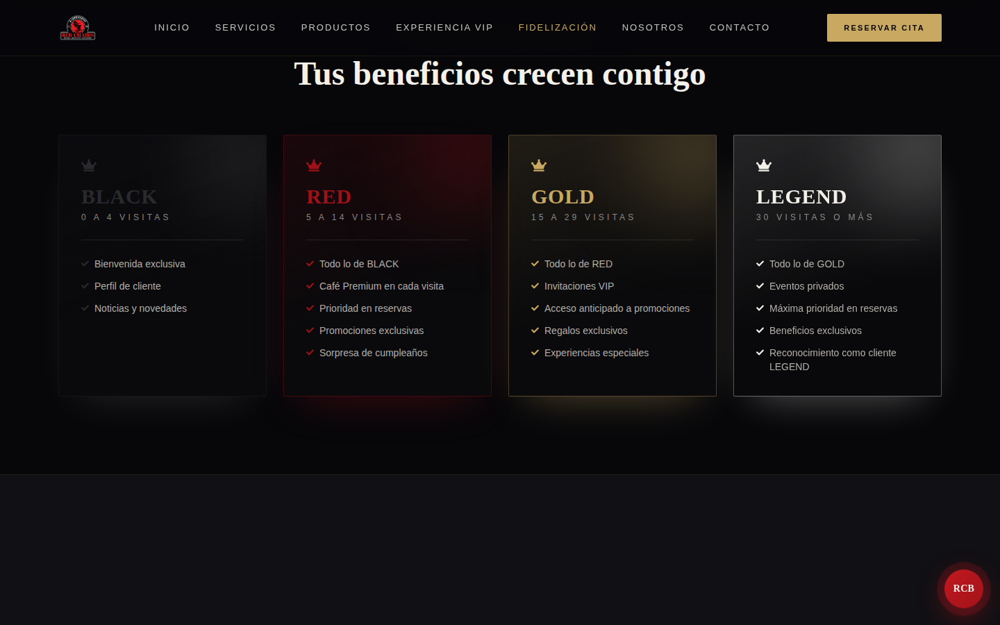
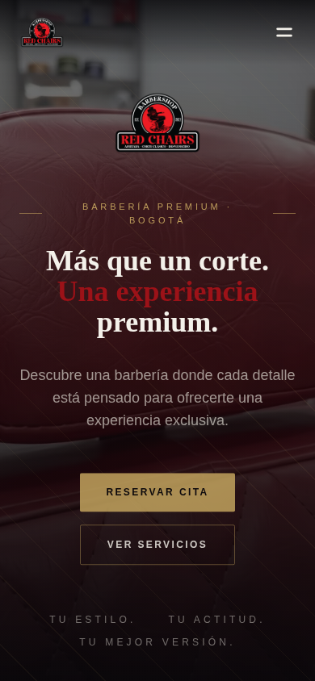
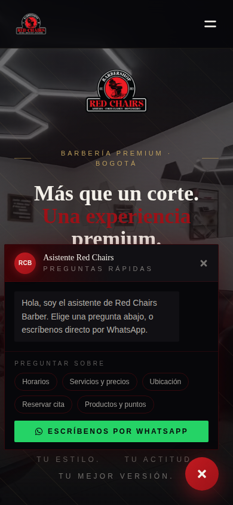

# Red Chairs Barber — Lo que hace especial a este sitio

Un recorrido visual por lo que distingue a este sitio de una página de barbería genérica: no es solo un catálogo con fotos, tiene detalles pensados a propósito para que se sienta premium y para que el negocio ahorre trabajo manual todos los días.

## 1. El video del local se controla con el scroll, no se reproduce solo

El fondo del hero es un recorrido en video del local real. No es un video que se reproduce en loop por su cuenta: **el scroll controla directamente en qué momento del video va** — quieto si no scrolleas, avanza al bajar, retrocede al subir. Comparando las dos capturas de arriba (la primera es el tope de la página, la segunda es después de bajar un poco) se ve claramente que cambió de escena.

Esto también evita un problema típico de los navegadores móviles: como el video nunca se reproduce solo, no depende de que cada navegador (Safari, Chrome, Android) permita el autoplay — cada uno tiene reglas distintas para eso.

## 2. Un asistente propio, sin depender de servicios externos de pago

El botón rojo "RCB" aparece solo cuando el visitante hace scroll (no compite con el hero desde el primer segundo). Al abrirlo, responde al instante preguntas frecuentes — horarios, precios por categoría, ubicación, cómo reservar, productos y puntos — usando la misma información que ya vive en el sitio, sin necesitar un servidor aparte ni una suscripción a un servicio de inteligencia artificial. Y siempre deja a la mano el botón para escribir directo por WhatsApp.

## 3. Un catálogo de servicios que se explica solo

Cada servicio muestra su precio y qué incluye, organizado por categoría con navegación rápida arriba (Clásicos, Premium, Faciales, Combos, Extras, Upgrade). El cliente entiende qué está comprando antes de reservar, sin tener que preguntar.

## 4. La Experiencia VIP, presentada como lo que es: un ritual

Un servicio de una hora y media a dos horas necesita sentirse distinto a un corte rápido — la página lo trata como una experiencia completa, no como un producto más en una lista.

## 5. Un programa de fidelización con niveles que suben solos

Cuatro niveles (BLACK, RED, GOLD, LEGEND) que se activan automáticamente según cuántas veces ha visitado el negocio cada cliente — sin que nadie tenga que llevar la cuenta a mano. Cada nivel desbloquea más beneficios que el anterior, dándole al cliente una razón concreta para volver.

## 6. Se ve igual de cuidado en el celular

La mayoría de quienes visitan una barbería desde su teléfono, no desde una computadora. El sitio está pensado primero para ese caso — el hero, el asistente y todo lo demás se adaptan sin perder legibilidad ni verse apretado.

---

*Estas capturas se tomaron en un entorno de desarrollo local, así que páginas que dependen de datos reales (el catálogo de productos, las reservas en vivo, el panel administrativo) no aparecen aquí — para verlas tal cual las ve un cliente real, hay que visitar el sitio publicado.*
